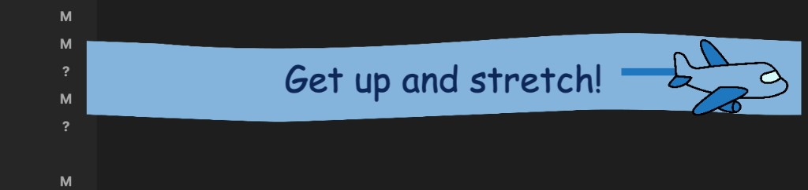

# ✈️ FlyMinder



A macOS menu bar app that flies your custom message across the screen on a schedule — reminding you to **walk**, **stretch**, and take breaks.

Native SwiftUI · menu bar only · floats above fullscreen apps · no account required.

> **Tip:** Replace `media/demo.png` with a short screen recording (`demo.gif`) for the best first impression.

---

## Attribution

FlyMinder is a fork of [meeting-reminder](https://github.com/conniexu444/meeting-reminder) by [Connie Xu](https://github.com/conniexu444).

This fork pivoted from calendar-based meeting alerts to interval-based movement reminders, removed the EventKit calendar integration, and added an iOS companion app with a shared settings layer.

---

## Requirements

- **macOS 14 (Sonoma)** or later
- **Xcode 15** or later (to build from source)

---

## Quick start

```bash
open FlyMinder.xcodeproj
# Select the FlyMinder scheme → Press ⌘R
```

## Build for distribution

```bash
chmod +x scripts/build.sh
./scripts/build.sh          # → FlyMinder.app
./scripts/build.sh --dmg    # → FlyMinder.app + FlyMinder.dmg
```

Run tests:

```bash
xcodebuild test -project FlyMinder.xcodeproj -scheme FlyMinder -destination 'platform=macOS'
```

---

## Features

- Custom banner message (up to 45 characters)
- Reminders every 20, 30, 45, or 60 minutes with live countdown
- Menu bar only — no Dock icon
- Floats above fullscreen apps
- Launch at login
- iCloud sync for message + interval (see `docs/icloud-setup.md`)
- iOS balloon prototype (`FlyMinderMobile` scheme)

---

## Project structure

```
FlyMinder/
├── FlyMinderApp.swift             # @main + MenuBarExtra
├── AppController.swift            # Coordinator
├── AirplaneView.swift             # Banner animation
└── Assets.xcassets/
FlyMinderTests/                    # Scheduler unit tests
FlyMinderMobile/                   # iOS balloon prototype
Shared/
├── FlyMinderSettings.swift        # iCloud + local settings
└── StretchReminderScheduler.swift # Interval timer (Mac + iOS)
scripts/build.sh
website/
```

---

## License

MIT — see [LICENSE](LICENSE). Includes components derived from [meeting-reminder](https://github.com/conniexu444/meeting-reminder).
